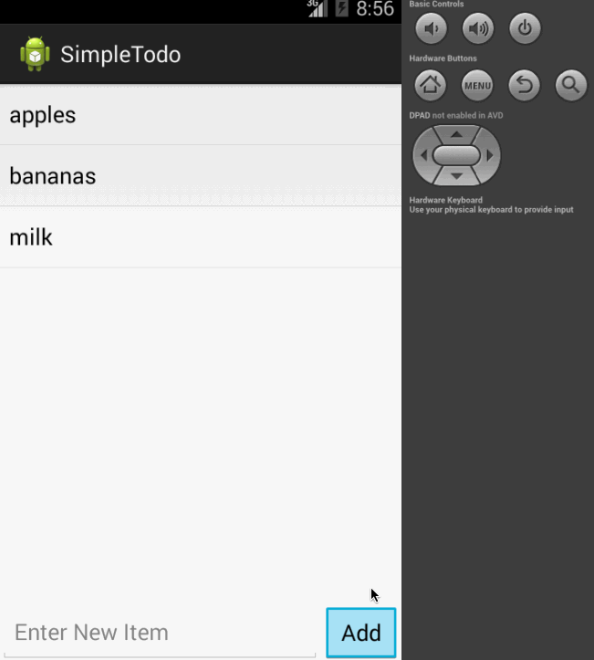

# Simple TODO App
## Intro to Android Class: Assignment 0 - Initial Project Todo App

This is a simple TODO list application that lets you track lists of items, such as things you need to do.

<b>User Stories Completed</b>
<ol>
 <li> User can <b>view</b> list of <b>existing</b> TODO items.
 <li> User can <b>add</b> a new item to the TODO list.
 <li> User can <b>remove</b> an item from the TODO list.
</ol>

 

